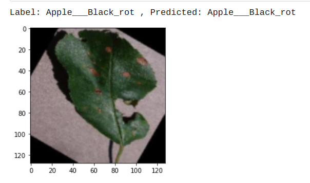
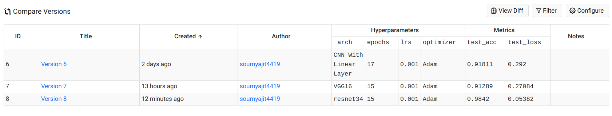

# Recognition of Plant Diseases by Leaf Image Classification 🌳

## Description

This project is an approach to the development of plant disease recognition model, based on leaf image classification, by the use of deep convolutional networks. The developed model is able to recognize 38 different types of plant diseases out of of 14 different plants with the ability to distinguish plant leaves from their surroundings.
All images are collected from Google Search Engine and crafted and filtered. It also suggests the type of crop we can grow on that particular soil. To implement this webapp we had used Flask (a framework of Python), which uses a convolution neural network on the back end to perform the above classification. Model is deployed on Heroku Platform (https://www.heroku.com/).

## Model deployed as Web-Application AP at:📳 
### Live link :
 <a href="https://plant49-ai.herokuapp.com/" target="_blank">https://plant49-ai.herokuapp.com/</a>
 
 ## Dataset available at: 📚  
The dataset used for training and evaluating the model:"https://www.kaggle.com/vipoooool/new-plant-diseases-dataset". 

## Leaf Image Classification

##  

This process for building a model which can detect the disease assocaited with the leaf image. The key points to be followed are:

1. Data gathering

   The dataset taken was **"New Plant Diseases Dataset"**. It can be downloaded through the link "https://www.kaggle.com/vipoooool/new-plant-diseases-dataset". It is an Image dataset containing images of different healthy and unhealthy crop leaves.

2. Model building

   - I have used pytorch for building the model.
   - I used three models:-
     1. The CNN model architecture consists of CNN Layer, Max Pooling, Flatten a Linear Layers.
     2. Using Transfer learning VGG16 Architecture.
     3. Using Transfer learning resnet34 Architecture.

3. Training

   The model was trained by using variants of above layers mentioned in model building and by varying hyperparameters. The best model was able to achieve 98.42% of test accuracy.

4. Testing

   The model was tested on total 17572 images of 38 classes. 
   The model used for prediction on sample images. It can be seen below:
   <!--  -->
   

   
   
   

5. Various Model Architecture tried along with Learning Rate and Optimizer and various accuracy obtained with different models.

  
  
 ## IO Screenshots:📷  
### This is the home page of our website :-
 
  
   
 
 

### Upload the image of a leaf :-

### These are the predicted result after uploading :-
 

## Flow chart :

## Details about the model

### The model will be able to detect 38 types of diseases of 14 Unique plants

- The detail list of plants and diseases can be seen in [List](Src)

## Purpose of the project
Food security for billions of people on earth requires minimizing crop damage by timely detection of diseases.Developing methods for detection of plant diseases serves the dual purpose of increasing crop yield and reducing pesticide use without knowing about the proper disease. Along with development of better crop varieties, disease detection is thus paramount goal for achieving food security. The traditional method of disease detection has been to use manual examination by either farmers or experts, which can be time consuming and costly, proving infeasible for millions of small and medium sized farms around the world.

## Dependencies:
For this project, the following tools were used:

1. Tensorflow 2 for building and training the model
2. Numpy for working with arrays
3. Matplotlib for visualizing the data
4. Flask for implementing the server side
5. HTML5, CSS3, JavaScript (with Web Speech API and particles.js) on the front-end.

